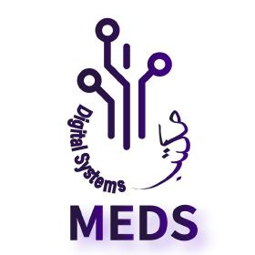

# *MEDS Training*

## *Progress*

### Module 1
 - [x] Setting up Linux
 - [x] Shell Scripting
 - [x] Setting Up Vim
 - [x] Getting Familiar with Vim
 - [x] Git Setup
 - [x] Integration of Git with VScode 
  
### Module 2
 - [x] Markdown Tutorial
    - [x] Adding Readme File 
    - [x] Adding Centered Figure
    - [x] Adding a CheckList of tasks
    - [x] Writing a Shell Scripting Tutorial
  

